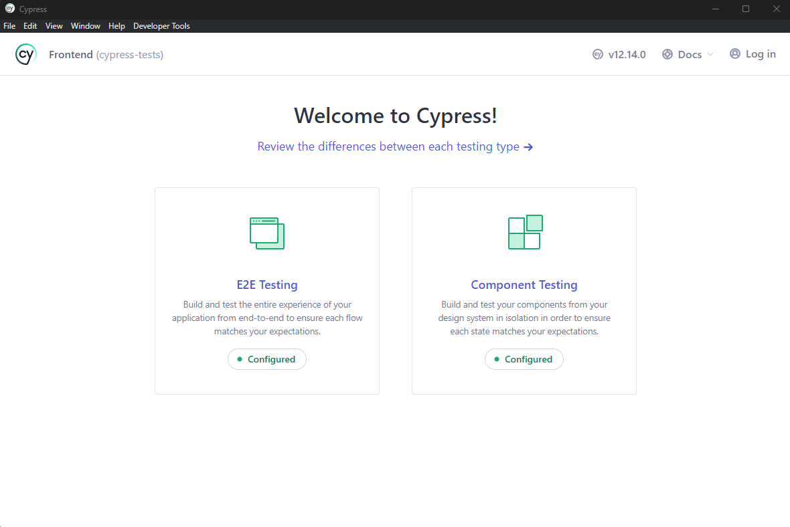
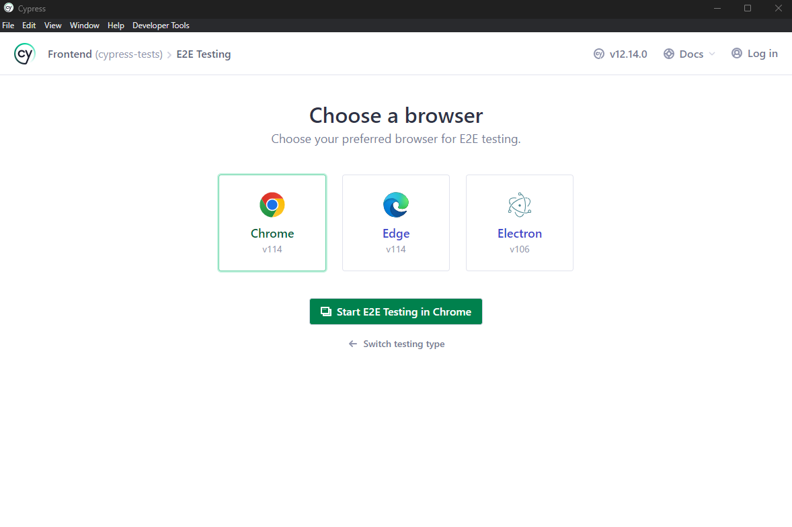
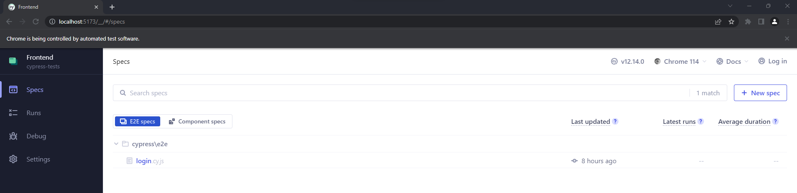
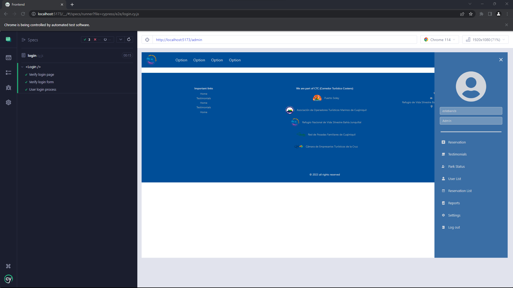

# Gestión y administración de los recursos del Refugio Nacional de Vida Silvestre Bahía Junquillal

## Descripción

El **Refugio Nacional de Vida Silvestre Bahía Junquillal**, asociada al Area de Conservación de Guanacaste, busca actualizar su sistema de *gestión administrativa y de reservas* del parque. 

El refugio desea migrar de un sistema manejado utilizando herramientas de edición de texto y tablas de cálculo a una **aplicación web** con interfaz para usuario, que permita simplificar el proceso actual.

La aplicación web en cuestión debe de contar con las siguientes funcionalidades:

* Módulo de reservas: para picnic, camping y kayak
* Módulo de registro: control detallado de toda la información de los visitantes
* Módulo de ventas: gestión financiera, relacionada a las ventas
* Planning de ocupación: control de aforo y calendarios (cupo limitado)
* Mapa de ocupación: entradas programadas y realizadas en los espacios de la zona de camping y camper
* Módulo de filtros o reporte de datos: estadísticas y gráficos respecto a las distintas variables de interés

## Manual de usuario

### Instalación de dependencias

Dentro de los directorios ```src/Frontend``` y ```src/Backend``` ejecute el siguiente comando, con la finalidad de instalar los paquetes necesarios para la ejecución de las aplicaciones:

```
npm install
```

### Ejecución del código

Este proyecto está desarrollado como dos aplicaciones diferentes, una que maneja el frontend y otra el backend. Para ejecutar el frontend debde dirigirse a la carpeta **Frontend** y ejecutar el siguiente comando:

```
npm run dev
```

Con esto el frontend comenzará a correr en el siguiente en ```http://localhost:5173/```.

De la misma forma, para ejecutar la aplicación backend, diríjase a la carpera **Backend** y ejecute el siguiente comando:

```
npm run dev
```

Lo anterior hará que la aplicación del backend se empiece a ejecutar en ```http://localhost:3000/```. Es necesario recalcar que para que el sistema funcione correctamente ambas aplicaciones deben estar ejecutandose a la vez.

### Pruebas unitarias

Se utiliza la biblioteca ```jest``` para estas pruebas. Cada aplicacion del proyecto tiene su proyecto de pruebas unitarias, para correr las pruebas es importante mencionar que por lo menos la aplicación del Backend debe estar ejecutandose. Una vez las aplicaciones estén en ejecución, en una nueva consola debe dirigirse a ```src/Frontend``` o ```src/Backend``` y ejecutar el siguiente comando:

```
npm test
```

Esto correrá las pruebas unitarias de todas las suits la aplicación seleccionada, para correr solo las pruebas de un determinado archivo deberá expecificarlo en el comando, por ejemplo:

```
npm test useTicket.test.js
```
Los archivos de pruebas unitarias se encuentran en la carpeta de ```__test__``` de cada aplicación.

### Pruebas automatizadas 

Se emplea la biblioteca ```cypress``` para etse fin. Las pruebas se encuentran en ```src/Frontend/cypress/e2e```, como requisito para la ejecución de estas pruebas es necesario que tanto la aplicación de Frontend como Backend estén en ejecución. Para correr las pruebas automatizadas hay que utilizar el siguiente comando en la ```src/Frontend```:

```
npm run cypress:run
```
Este comando ejecutará todas las pruebas existentes y dará un reporte en consola, adicional a eso, se generarán y guardarán videos de la ejecución de cada prueba en la carpeta ```src/Frontend/cypress/videos```. Si en cambio se desea ejecutar cada prueba de forma individual, use el siguiente comando:

```
npm run cypress:open
```

Una vez ejecutado el comando se desplegará la siguiente ventana, seleccione la opción ```E2E Testing```:
<div style="text-align:center">
  
</div>

Luego seleccione el navegador de su preferencia para realizar las pruebas:
<div style="text-align:center">
  
</div>

A continuación, escoja el archvo de pruebas que desea ejecutar:
<div style="text-align:center">
  
</div>

Una vez escogido el archivo de pruebas estas empezarán a ejecutarse:
<div style="text-align:center">
  
</div>

### Despliegue para producción

Para subir la aplicación a un servidor de producción antes se debe realizar un ```build``` a la aplicación del Frontend, para esto hay que dirigirse a la carpeta ```src/Frontend``` y ejecutar el siguiente comando:
```
npm run build
```
El comando anterior optimiza los archivos del proyecto y elimina las dependencias de desarrollo por lo que vuelve al proyecto bastante más ligero. Después de hecho el build, el código se ejecuta con los mismos comandos mencionados con anterioridad.


## Diseño de la aplicación

La aplicación será desarrollada utilizando el lenguaje de programación **JavaScript**, mediante la ayuda de los frameworks **ReactJS** y **NodeJS** para el manejo del front-end y el back-end respectivamente. Para más información, refierase al directorio [design](design/README.md).

### Mockup

Para más información, refierase al directorio [mockups](design/mockups/).

### Base de datos

Para más información, refierase al directorio [database](design/database/).

## Créditos

### Desarrolladores

* Esteban Castañeda Blanco: C01795
* Daniel Lizano Morales: C04285
* Israel López Vallecillo: C04396
* Carlos Quesada Estrada: C06133
* Dylan Gabriel Tenorio Rojas: C07802

### Terceros

* [Axios](https://axios-http.com/)
* [ExpressJS](https://expressjs.com)
* [Figma](https://www.figma.com/)
* [NodeMailer](https://nodemailer.com/about/)
* [Node-QRCode](https://github.com/soldair/node-qrcode)
* [Tailwind](https://tailwindcss.com/)
* [Vite](https://vitejs.dev/)
