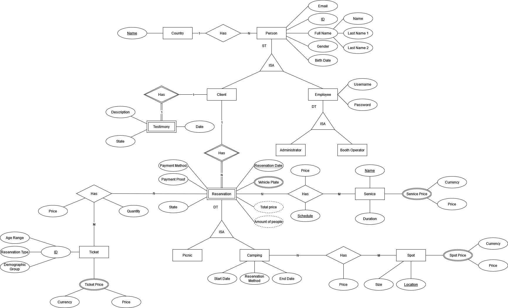

# Base de datos

## Diseño conceptual

La siguiente imagen muestra el diseño conceptual de la base de datos.

## Diseño relacional

Con base en el diagrama conceptual anterior, se realizó el diseño relacional. Para mappear las entidades involucradas en una ISA, se utilizó el mappeo 8A, dado que se consideró que este mappeo tiene más sentido para el contexto en cuestión. Un ejemplo de esto es que las superclases se encuentran relacionadas a otras entidades, por lo cual conviene conservar esta superclase en el diseño relacional.

En la ISA Person utilizamos 8A debido a que tenemos un ST consideramos que sería mejor tener a las subclases en tablas diferentes para mayor control y diferenciación.

En la ISA Employee tenemos un 8B ya que tenemos un DT y la unica diferencia entre las subclases es el tipo, que usaremos para dar permisos y nos funcionaria mas en un atributo que tener diferentes tablas.

En la ISA Reservation utilizamos 8A porque aunque tenemos un DT debemos usar 8A debido a la relación de Camping con Spot para evitar que tuplas de Picnic tengan esta relación si utilizamos 8B.

En el siguiente enlace se puede observar el PDF con el mapeo realizado:

[Diseño relacional de la base de datos](relationalMapping.pdf)

## Indices

Se realizaron dos índices *non-clustered* sobre dos tablas distintas en la base de datos.

1. Camping_Index: se crea sobre la tabla **Camping** utilizando sus atributos **Start_Date** y **End_date**
2. Picnic_Index: se crea sobre la tabla **Picnic** utilizando su atributo **Picnic_Date**

Ambos índices se crearon dado que una porción importante de las consultas realizadas sobre la base de datos utiliza las fechas para filtrar las reservas y los datos asociados a estas, por lo que con la creación de estos índices se mejoraría el rendimiento.

Para más detalles sobre estos índices, refiérase al archivo [indexes.pdf](indexes.pdf).

## Procedimientos almacenados

### Procedimientos de uso común

1. ReservationBetweenDates: se encarga de encontrar las reservas, ya sea de camping o de picnic, entre dos fechas

2. ReservationInADate: se encarga de encontrar las reservas, ya se de camping o de picnic, en una fecha determinada

3. TotalPriceReservation: se encarga de calcular el precio total de una reserva, tomando en cuenta su tipo de reserva, la cantidad de días que permanece en el parque (si es camping) y los servicios

4. PeopleInReservation: se encarga de encontrar la cantidad de personas asociadas a una reserva en específico

5. RemainingPicnicCapacity: calcula la capacidad restante en el parque para picnic con base en el aforo predeterminado por los encargados del parque y para una fecha en específico; se calcula la capacidad tanto para reservas en línea como en sitio

6. RemainingCampingCapacity: calcula la capacidad restante en el parque para camping con base en el aforo predeterminado por los encargados del parque y para una fecha en específico; se calcula la capacidad tanto para reservas en línea como en sitio

### Procedimientos de generación de reportes

1. DailyIncomeCamping: calcula los ingresos diarios del parque, dado un rango de fechas, generados por dar servicios de **camping**

2. DailyIncomePicnic: calcula los ingresos diarios del parque, dado un rango de fechas, generados por dar servicios de **picnic**

3. ReservationsByVisitor: obtiene la información no personal de los visitantes del parque entre un rango de fechas

## Transacciones

La transacción realizada pretende insertar todos los datos de una reserva a manera de transacción, por lo que si una de las inserciones falla, no queda la posibilidad de resultar en información incoherente dentro de la base de datos. 

### Frontend

La transacción es llamada dentro del archivo `src/Frontend/src/hooks/useInsertReservation.jsx`, en la función **insertReservation** en la línea 96.

### Backend

La transacción es realizada en el archivo `src/Backend/src/models/reservationModel.js`. Se decidió realizar una transacción para *picnic* y otra para *camping*, dado que deben de insertar datos distintos para cada caso.

Las transacciones están incluidas en las funciones **reservationCampingTransaction** y **reservationPicnicTransaction**, en las líneas 11 y 97 respectivamente.

### Nivel de aislamiento

Se utiliza un nivel de aislamiento de ***read uncommitted***, esto como consecuencia de que esta transacción no debe de realizar operaciones de read, por lo que no podría presentar problemas de *dirty reads* o entre otros que sean ocasionados por inconsistencias en los valores de la base de datos. 

## Triggers

1. UpdateTicketGreaterThanZero: trigger sobre la tabla **Ticket**, donde en lugar (*INSTEAD OF*) de actualizar la tabla, primero se realiza una verificación que el precio del tiquete sea mayor a cero. Si es así, se procede con la actualización; caso contrario, no se altera la tupla

## Scripts

* Script SQL de creación de [tablas](BD_LosOsitos.sql)
* Script SQL de creación de [procedimientos almacenados](procedures.sql)
* Script SQL de creación de [triggers](trigger.sql)
